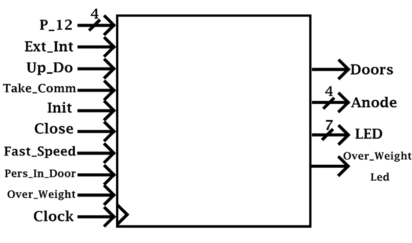

## Elevator_in_VHDL
# 1.	Project specification 

Project theme: 

To design an automaton that commands an elevator in a Gf + 12 floors hotel. The elevator must respond to the requests of the people both inside and to the requests that appear along the doors at each level. The order of fulfillment of the requests takes into consideration the direction of travel (ascent or descent). The requests are ordered in the order of the floors, regardless of where they come from (interior or exterior). The elevator has an entrance that detects exceeding the maximum allowed weights and does not start in this case. Departure does not take place if the doors are not closed. The doors do not close if there is anyone in the door. There is a waiting time until the doors close. It is considered that at the beginning the elevator is located on the ground floor with the doors open.

# 2.	Block scheme

 First, we will present it in the form of a black box, with the inputs and outputs of the machine:
 
 
 
## Inputs:

•	P_12 (Switches): 4bit input which uses 4 switches to command where the elevator should go. The command is given from the interior or the exterior of the elevator. Every floor has a binary code, for example: Ground floor: “0000”, 8th floor: “1000”,

•	Ext_Int (Switch): selects if the command is given from the exterior or the interior of the elevator. If command is ‘1’ this means that the command is given from the exterior of the elevator and ‘0’ for the interior,

•	Up_Do (Switch): select if the elevator will move up or down to take the person who command if the command is given from the exterior of the elevator; in the case that the command is given from the interior, the move of the elevator is selected automatically,

•	Corresponding codes for different comnads: “00” – no command, “01” – command from interior”, “10”-exterior command to go down, “11” – exterior command to go up,

•	Take_Command (Button): stores the new command and start the elevator if possible,

•	Init (Button): initializes the elevator,

•	Close (Button): closes the doors of the elevator immediately. If it is not pressed, the doors of the elevator will close automatically after some time (if given the command to which floor it should go),

•	Fast_Speed (Switch): determines which timer should use (1 second or 3 seconds); if command is ‘1’ this means that the 3 seconds timer is selected and if command is ‘0’ this means that the 1 second timer is selected,

•	Person_In_Door (Switch): will not allow the doors to get closed if there is a person between them,

•	Over_Weight (Switch): if it is selected that means that the maximum weight has been exceeded and will not allow the elevator to start,

•	Clock

## Outputs:

•	Doors: will light up a led if the doors are open,

•	Over_Weight_Led: will light up a led if the total weight of all the persons is over the maximum weight,

•	Anode,

•	Led: will show at which floor the elevator is, for example:   for the 9th floor.

## General Organigram:

State A represents the initial state of the elevator. Once the doors are closed the system
comes into a state B in which it is searching for commands in the memory. If the direction was ‘1’ (up) this means it will search first for orders at the upper level and if it was ‘0’ (down) at the lower levels. Once it finds a command the elevator begins to move until it receives a “stop” signal that it has an order to that current level. In the end it goes back to the initial state and it opens the doors.

## Bloc Scheme:

In order to make this design we had to identify some units that do some given tasks. We clearly need a command unit, the unit that controls everything, every other unit, in our design. But the command unit alone would, in this way, make a lot by itself, so another unit to help the command unit would be better. 
This unit is called the decide unit, and it activates only when it receives an enable signal from the command unit. The decide unit is used only when the elevator has begun its movement and it should decide whether it stops to the current level or not. For the decide unit to give the stop signal, it first need to find an order in the memory at the current level, of the elevator, and, also, that order must satisfy one of the conditions so that it can be taken:

-It is an order given from the interior,

-If it is from the exterior it should be in the same direction,

-If it is from the exterior and it is not in the same direction, we take it only if there are not commands at the further levels. This case also implies the changing of direction, as there are no commands left in the current direction.

The rest of the units that we need are part of the execution unit. A ram memory unit is needed to store the commands and delete them after we took them. A level search unit would also be useful to help us search in the memory for orders at some levels. Direction unit is used to store the direction of the elevator, which is up or down. The actual movement of the elevator is done by an increase/decrease level unit, which adds or extracts ‘1’ from the current level. It also stores the current level. Timer unit is used to count 6 second before the doors gets closed. Doors cannot get closed if we are not allowed by the sensor unit, which receives the person in door signal or over-weight signal. Display unit must display the current level on LEDs. Delay unit just introduces a 3 second delay before we begin the ‘movement’ of the elevator (equivalent with the start engine time).

Frequency divider is used to obtain a one second clock pulse from the board clock signals. With the speed unit we can choose the speed between levels which is 1 second or 3 seconds.

# 3.	Phases of Design

Components:
## 1.Ram Memory Unit

Its main components are the actual RAM memory and two multiplexers (2:1 on 4 bits).
The first multiplexer writes data in the ram, and the second chooses the address.
Both multiplexers have the Take_Comm signal (take command) as the selection signal. 
To write in the ram a new order (take_comm gets activated), the multiplexers choose to write at the address P_12 (level encoding) the data about the order (from interior or exterior, up or down). To delete an order, it will simply be written ‘00’ on data ports at the address of the level from the level search unit.
The logic gates should identify if there is a command at the address Lvl_Mem (when reading from the memory), and if yes to identify its type, for example ‘Ext_Down’, this information is needed also.

## 2.Level Search Unit

Is based on a bidirectional counter. Given the commands from the command unit and also decide unit it has to count up or down, to help us search in the memory the levels one by one.
It also receives parallel load signals, to store the current level of the elevator and to start counting from that point.
To delete the order that have just been honored, the command unit does a parallel load of the curr_lvl in the level search unit (lvl_mem becomes curr_lvl) and then activate the delete signal from ram memory unit.
TU (terminal up count) and TD (terminal down count) informs the command or decide unit that it finished counting.

## 3.Increase/Decrease Level Unit 

Its main components are a 4 xor gates, a full adder, and a register that holds its state.
Based on the not_dir signal (dir signal inverted) it adds ‘1’ or subtracts ‘1’ from the curr_lvl which is stored in the hold register. The hold register does not change its state unless the LD port is activated by the move signal and the Div clock signal is received (it can be 1 sec or 3 sec representing the speed between levels). Hold register stores the codification for the current level on 4 bits. Curr_lvl signal is further transmitted to the display unit (so we can see it), to the level search unit, and as a feedback to the full adder to increase or decrease it by one.

## 4.Direction Unit

Stores the direction of the elevator ‘1’ means up and ‘0’ means down.
The direction is changed from ‘1’ to ‘0’ of from ‘0’ to ‘1’ by the change_dir signal which activates the j and k simultaneously to make a toggle.
Q is the dir signal and NQ is the not_dir signal.

## 5.Timer Unit

Gets enabled when the doors are open and counts 6 seconds. When timer end is active the doors get closed (if there is no keep open signal from the sensor unit).

## 6.Sensor Unit

If there is a person in doors or the maximum weight is reached it will send a keep open signal that does not allow to doors to get closed. Also, it can activate a led in case of over-weight.

## 7.Display Unit

Simply displays the current level on the LEDs.

## 8.Delay Unit

Introduces a delay before the elevator starts moving and goes to the next level. It takes some time for the elevator to start its movement, to start an engine.

## 9.Speed Unit

Selects the speed between the levels. It can either be 1 seconds or 3 seconds.

## 10.Decide Unit:

After enable, it starts searching in the memory to identify if it has a command at the current level. When a command is found it also needs to identify its type to know if it should stop the movement of the elevator or not. 
If it is an interior command, or a command from exterior in its direction it stops. But if it has a command from the exterior and in opposite direction it continues searching for orders at the further levels. If it still has orders at the further levels it does not stop. 
In this way, if someone at some level wants to go down and the elevator comes from the lower levels to his level (thus moving up, direction is ‘1’) then it will not take this person, unless  it does not have command at some other upper levels. Otherwise, it will take that person up and then down, this being a waste of time and resources.

## 11.Command Unit:

This is the unit that controls all the other units.
When the close doors button is activated or the timer ends, and there is no keep open signal from sensors active, the doors get closed.
The current level of the elevator is loaded and now it begins searching in the memory for commands to set the direction in which the elevator will go. The search in the memory for commands is made based on the Dir signal.
 Let us suppose that the direction (Dir signal) was ‘1’ then it will search for commands at the upper parts first in order to maintain its direction (to continue going up). If there is a command at the upper level then it will enable decide and begin its movement (up), waiting for the stop signal from the decide unit to arrive. If it does not find an order at the upper levels, then it will change the direction in the direction unit and will begin searching for orders at the lower levels. It goes so on until it will eventually find an order. The order can also be at the exact current level of the elevator.
When an order is honored, the command unit deletes it from the memory and opens the door, going back to its initial state. 

